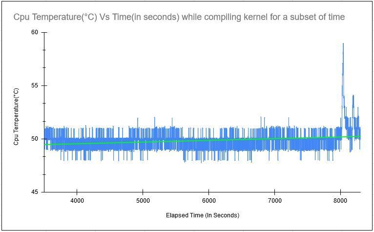

# Report on Raspberry-Pi Performance During Kernel Compilation

## Introduction:
The major task specified in this report involves plotting the data present in kernel_performance_data file, consisting of "Time elapsed" in seconds and "CPU Temperature" in degree C, in the form of line graphs to get an insight how the temperature varies during kernel compilation. 
The first graph shows a line chart plotted using the kernel_performance_data which consisted of reading for 8305 observations, that is temperature noted each second for a total of 8305 seconds.

The second graph provided shows a line chart plotted using the readings through a subset of kernel_performance_data which consisted of reading from 3500 to 8305 seconds, roughly around 4800 readings. The relationship between temperature and time elapsed seems to be uniform with the guiding line being straight. This is the time when kernel compilation was in the middle state, which further concurs that stability was achieved in middle of it.

## Conclusion
From both of the plots provided, it is concluded at no point during the compilation, the raspberry pi reaches a high enough temperature to throttle, which is generally around 85°C, and hence remained at it's full throughout-bar. This means that even though it is like a mobile CPU with no fans, raspberry pi 4 can still easily compile a kernel without affecting the hardware, given it was tested under various scenarios with CPU usage as high as 98.4%. Thus, I can conclude that compiling this particular kernel on raspberry pi-4 won't affect the hardware and won't allow the pi to throttle.
